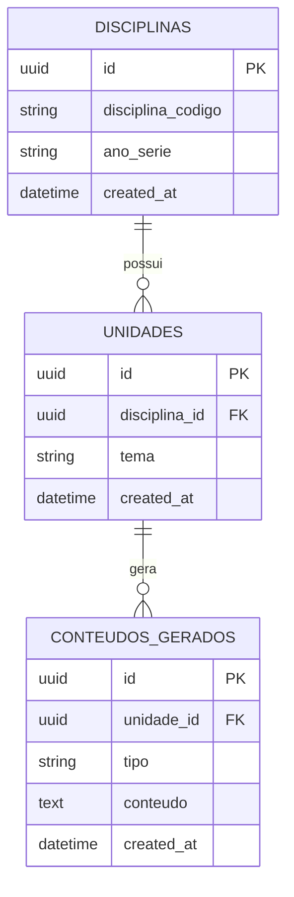

#  AI Assistant for Teacher - Backend

> Sistema Inteligente para Geração de Materiais Didáticos de Cultura Digital

[](https://www.typescriptlang.org/)
[](https://nodejs.org/)
[](https://www.fastify.io/)
[](https://www.prisma.io/)
[](https://openai.com/)

---

##  Índice

- [ Sobre o Projeto](#sobre-o-projeto)
- [ Visão Geral do Sistema](#visão-geral-do-sistema)
- [ Principais Funcionalidades](#principais-funcionalidades)
- [ Arquitetura](#arquitetura)
- [ Modelo de Dados](#-odelo-de-dados)
- [ Fluxo de Geração de Conteúdo](#fluxo-de-geração-de-conteúdo)
- [ Tecnologias Utilizadas](#tecnologias-utilizadas)
- [ Instalação e Configuração](#instalação-e-configuração)
- [ Integração com API RAG](#integração-com-api-rag)
- [ Documentação da API](#documentação-da-api)
- [ Scripts Disponíveis](#scripts-disponíveis)
- [ Estrutura de Arquivos](#estrutura-de-arquivos)
- [ Alinhamento com a BNCC](#alinhamento-com-a-bncc)
- [ Papel da Inteligência Artificial no Desenvolvimento](#papel-da-inteligência-artificial-no-desenvolvimento)
- [ Considerações de Segurança](#considerações-de-segurança)
- [ Troubleshooting](#troubleshooting)
- [ Documentos Técnicos](#documentos-técnicos)
- [ Atendimento aos Requisitos do Hackathon](#atendimento-aos-requisitos-do-hackathon)
- [ Equipe e Contribuição](#equipe-e-contribuição)
- [ Licença](#licença)
- [ Agradecimentos](#agradecimentos)
- [ Contato e Suporte](#contato-e-suporte)

---

##  Sobre o Projeto

API backend desenvolvida para o **Hackathon IFPI Campus Piripiri** que visa apoiar professores do Ensino Fundamental e Médio na geração automática de materiais didáticos de **Cultura Digital**, alinhados à **Base Nacional Comum Curricular (BNCC)**.

###  Visão Geral do Sistema

```
                    ┌──────────────────────┐
                    │      Frontend        │
                    │   (Interface Web)    │
                    └──────────┬───────────┘
                               │
                               │ HTTP REST
                               ▼
                    ┌──────────────────────┐
                    │      API Central     │
                    │    (Este Backend)    │
                    │                      │
                    │  • Gestão Disciplinas│
                    │  • Gestão Unidades   │
                    │  • Orquestração      │
                    └─────┬──────────┬─────┘
                          │          │
           ┌──────────────┘          └───────────────┐
           │ Consulta BNCC             Gera Conteúdo |
           ▼                                         ▼
    ┌─────────────────┐                   ┌──────────────────┐
    │   API RAG BNCC  │                   │   OpenAI API     │
    │  (LlamaIndex)   │                   │   (GPT-4o-mini)  │
    │                 │                   │                  │
    │ • Busca vetorial│                   │  • Planos de aula│
    │ • Extrai hab.   │                   │  • Atividades    │
    │ • Contexto BNCC │                   │  • Sugestão temas│
    └─────────────────┘                   └──────────────────┘
           │
           │ Lê
           ▼
    ┌─────────────────┐
    │  BNCC (PDF)     │
    │  600 páginas    │
    │  Vector Store   │
    └─────────────────┘
```

**Fluxo de Trabalho:**
1.  Frontend envia requisição → API Central
2.  API Central consulta API RAG → Contexto BNCC estruturado
3.  API Central usa contexto + prompt → OpenAI gera conteúdo
4.  API Central salva no banco de dados
5.  API Central retorna resposta → Frontend exibe para o professor

###  Principais Funcionalidades

-  **Gestão de Disciplinas**: Cadastro e gerenciamento de disciplinas por ano/série
-  **Criação de Unidades**: Organização de conteúdos em unidades temáticas
-  **Sugestão Automática de Temas**: IA sugere temas de cultura digital baseados na BNCC
-  **Geração de Planos de Aula**: Criação automática com alinhamento pedagógico
-  **Geração de Atividades Avaliativas**: Atividades personalizadas por unidade
-  **Integração RAG + BNCC**: Busca semântica em documentos oficiais para embasamento pedagógico

---

##  Arquitetura

O projeto utiliza **Clean Architecture** com separação em 3 camadas principais:

```
src/
├── 01-application/        # Casos de uso e regras de negócio
│   ├── dtos/             # Data Transfer Objects
│   └── usecases/         # Lógica de aplicação
├── 02-domain/            # Entidades e interfaces do domínio
│   ├── entities/         # Modelos de negócio
│   ├── interfaces/       # Contratos de serviços
│   ├── mappings/         # Mapeamentos de códigos
│   └── types/            # Tipos do domínio
├── 03-infrastructure/    # Detalhes técnicos e frameworks
│   ├── db/              # Repositórios Prisma
│   ├── http/            # Controllers e Routes (Fastify)
│   ├── service/         # Integrações externas (OpenAI, RAG)
│   └── prisma/          # Cliente Prisma
├── 04-data/             # Dados estáticos (Mapeamento para disciplinas e ano/serie, Diretrizes MEC)
└── DI/                  # Container de Injeção de Dependências
```

###  Modelo de Dados



###  Fluxo de Geração de Conteúdo

```
1. Professor cria/seleciona Disciplina
         ↓
2. Sistema sugere Temas (OpenAI) ou professor cria manualmente
         ↓
3. Professor escolhe Tema e tipos de conteúdo (plano, atividade)
         ↓
4. Sistema consulta API RAG → Busca contexto na BNCC
         ↓
5. Contexto BNCC + Diretrizes_MEC + Tema → OpenAI gera conteúdos
         ↓
6. Conteúdos salvos e retornados ao professor
```

---

##  Tecnologias Utilizadas

| Tecnologia       | Versão | Uso                                 |
|------------------|--------|-------------------------------------|
| **Node.js**      | 18+    | Runtime JavaScript                  | 
| **TypeScript**   | 5.9+   | Tipagem estática                    | 
| **Fastify**      | 5.6+   | Framework HTTP de alta performance  |
| **Prisma**       | 6.19+  | ORM para banco de dados             |
| **SQLite**       | -      | Banco de dados (desenvolvimento)    | 
| **OpenAI API**   | 6.16+  | Geração de conteúdo via GPT-4o-mini |
| **LlamaIndex**   | -      | RAG (API separada)                  |
| **Axios**        | 1.13+  | Cliente HTTP para integração RAG    |

---

##  Instalação e Configuração

### Pré-requisitos
- **Node.js** 18.x ou superior
- **npm** ou **yarn**
- **Chave API da OpenAI** ([obter aqui](https://platform.openai.com/api-keys))
- **API RAG em execução** (repositório: [my-app](https://github.com/rn-Rauan/my-app.git))

### 1. Clonar o Repositório

```bash
git clone <URL_DO_REPOSITORIO>
cd AI-ASSISTANT-FOR-TEACHER/Backend
```

### 2. Instalar Dependências

```bash
npm install
```

### 3. Configurar Variáveis de Ambiente

Crie um arquivo `.env` na raiz do projeto Backend:

```env
# Banco de Dados local SQLite para teste
DATABASE_URL="file:./dev.db"

# OpenAI API Key
OPENAI_API_KEY="sk-proj-xxxxxxxxxxxxxxxxxxxxx"

# API RAG (LlamaIndex)
RAG_API_URL="http://localhost:3001"
```

 **IMPORTANTE**: Altere o endereço da API RAG no arquivo [`src/DI/container.ts`](src/DI/container.ts#L45) se necessário:

```typescript
// Linha 45
export const ragBnccService = new RagBnccService("http://localhost:3001");
```

### 4. Configurar Banco de Dados

```bash
# Executar o generate
npx prisma generate

# Executar migrations
npx prisma migrate dev

# (Opcional) Abrir Prisma Studio para visualizar dados
npx prisma studio
```

### 5. Iniciar Servidor de Desenvolvimento

```bash
npm run dev
```

O servidor estará rodando em **`http://localhost:3131`**

---

##  Integração com API RAG

Este projeto depende de uma **API externa de RAG** (Retrieval-Augmented Generation) que indexa a BNCC usando LlamaIndex.

### Como Rodar a API RAG

```bash
# Clonar repositório da API RAG
git clone https://github.com/rn-Rauan/my-app.git
cd my-app

# Seguir instruções do README da API RAG
npm install
npm run api  # Deve rodar em http://localhost:3001

```
---

##  Documentação da API

### Endpoints Principais

####  Disciplinas

| Método   | Endpoint                         | Descrição                            |
|----------|----------------------------------|--------------------------------------|
| `GET`    | `/disciplinas`                   | Lista todas as disciplinas           | 
| `GET`    | `/disciplinas/:id`               | Busca disciplina por ID              |
| `POST`   | `/disciplinas`                   | Cria nova disciplina                 |
| `DELETE` | `/disciplinas/:id`               | Remove disciplina                    |
| `GET`    | `/disciplinas/:id/sugerir-temas` | IA sugere 5 temas de cultura digital |

####  Unidades

| Método   | Endpoint                       | Descrição                        |
|----------|--------------------------------|----------------------------------|
| `GET`    | `/unidades?disciplina_id=<id>` | Lista unidades de uma disciplina |
| `GET`    | `/unidades/:id`                | Busca unidade por ID             |
| `POST`   | `/unidades`                    | Cria nova unidade manualmente    |
| `DELETE` | `/unidades/:id`                | Remove unidade                   |

####  Geração de Conteúdos ( Principal)

| Método | Endpoint                     | Descrição                                         |
|--------|------------------------------|---------------------------------------------------|
| `POST` | `/gerar/conteudos`           | **Cria unidade + gera conteúdos** (1 chamada RAG) |
| `GET`  | `/conteudos?unidade_id=<id>` | Lista conteúdos de uma unidade                    |

### Exemplo: Gerar Conteúdos

**Request:**
```http
POST /gerar/conteudos
Content-Type: application/json

{
  "disciplina_id": "uuid-da-disciplina",
  "tema": "Fake News e Verificação de Fontes",
  "tipos": ["plano_de_aula", "atividade"],
  "observacoes": "Turma com acesso limitado à internet"
}
```

**Response:**
```json
{
  "message": "Unidade criada com 2 conteúdo(s)",
  "unidade": {
    "id": "uuid-da-unidade",
    "tema": "Fake News e Verificação de Fontes",
    "disciplina_id": "uuid-da-disciplina",
    "created_at": "2026-01-20T..."
  },
  "conteudos": [
    {
      "id": "uuid-1",
      "tipo": "plano_de_aula",
      "conteudo": "# PLANO DE AULA: Fake News...",
      "unidade_id": "uuid-da-unidade",
      "created_at": "2026-01-20T..."
    },
    {
      "id": "uuid-2",
      "tipo": "atividade",
      "conteudo": "# ATIVIDADE AVALIATIVA...",
      "unidade_id": "uuid-da-unidade",
      "created_at": "2026-01-20T..."
    }
  ]
}
```

### Códigos de Disciplinas

| Código | Disciplina                         | Nível          |
|--------|------------------------------------|----------------|
| `LP`   | Língua Portuguesa                  | Fundamental II |
| `MA`   | Matemática                         | Fundamental II |
| `CI`   | Ciências                           | Fundamental II |
| `HI`   | História                           | Fundamental II |
| `GE`   | Geografia                          | Fundamental II |
| `AR`   | Arte                               | Fundamental II |
| `EF`   | Educação Física                    | Fundamental II |
| `IN`   | Inglês                             | Fundamental II |
| `LPP`  | Língua Portuguesa e Literatura     | Médio          |
| `MAT`  | Matemática                         | Médio          |
| `CHS`  | Ciências Humanas e Sociais         | Médio          |
| `CNT`  | Ciências da Natureza e Tecnologia  | Médio          |

### Anos/Séries

```typescript
"6_ANO"   | "7_ANO"   | "8_ANO"   | "9_ANO"     // Fundamental II
"1_SERIE" | "2_SERIE" | "3_SERIE"               // Médio
```

 **Documentação Completa**: Veja [`docs/API_DOCUMENTATION.md`](docs/API_DOCUMENTATION.md) e [`docs/RESUMO_API.md`](docs/RESUMO_API.md)

---

##  Scripts Disponíveis

```bash
# Desenvolvimento com hot-reload
npm run dev

# Build para produção
npm run build

# Executar produção
npm start

# Testar integração RAG
npm run test:rag

# Abrir Prisma Studio
npx prisma studio

# Resetar banco de dados
npx prisma migrate reset
```

---

##  Estrutura de Arquivos

```
Backend/
├── docs/                         # Documentação técnica
│   ├── ADR01.md                  # Decisões arquiteturais
│   ├── ADR02.md                  # Arquitetura RAG
│   ├── API_DOCUMENTATION.md      # Documentação completa da API
│   ├── API_RAG.md                # Integração com RAG
│   ├── DER.md                    # Modelo de dados
│   ├── RESUMO_API.md             # Resumo dos endpoints
│   └── hackathon.md              # Edital do projeto
├── prisma/
│   ├── schema.prisma             # Schema do banco
│   └── migrations/               # Histórico de migrations
├── src/
│   ├── 01-application/           # Casos de uso
│   ├── 02-domain/                # Entidades e interfaces
│   ├── 03-infrastructure/        # HTTP, DB, Services
│   ├── 04-data/                  # BNCC e Diretrizes MEC (JSON)
│   ├── DI/                       # Injeção de dependências
│   ├── server.ts                 # Servidor Fastify
│   └── test-rag.ts               # Script de teste RAG
├── package.json
├── tsconfig.json
└── README.md
```

---

##  Papel da Inteligência Artificial no Desenvolvimento

###  Visão Geral

A Inteligência Artificial desempenhou um papel **fundamental e estratégico** durante todo o desenvolvimento desta solução, atuando em duas frentes distintas:

1. **IA como ferramenta de apoio para o pensamento estratégico da solução e assistente no desenvolvimento do produto** (GitHub Copilot)
2. **IA como funcionalidade do produto** (OpenAI GPT-4o-mini + RAG)

---

###  IA como ferramenta de apoio para o pensamento estratégico da solução e assistente no desenvolvimento do produto

#### **GitHub Copilot - Assistente de Desenvolvimento**

O **GitHub Copilot** foi utilizado como no desenvolvimento, auxiliando a equipe em:

**Arquitetura e Design:**
- Interpretação e análise dos requisitos do edital do hackathon
- Auxílio na definição da arquitetura em camadas (Clean Architecture)
- Validação de decisões técnicas e padrões de projeto
- Sugestão de estruturas de pastas e organização do código

**Documentação:**
- Auxílio na criação deste README.md
- Auxílio na elaboração de documentação técnica (ADRs, DER, API Docs)
- Geração de comentários explicativos no código
- Criação de exemplos de uso da API

**Resolução de Problemas:**
- Identificação de bugs e inconsistências
- Sugestão de melhorias de performance

**Análise e Validação:**
- Revisão crítica do projeto em relação aos requisitos do edital
- Identificação de funcionalidades faltantes (ex: geração de slides)
- Sugestões de melhorias arquiteturais
- Validação de alinhamento com BNCC

---

### IA como Funcionalidade do Produto

No produto final, a IA é utilizada de forma **ética e controlada** para:

#### **1. Sugestão de Temas de Cultura Digital**
- Usa **OpenAI GPT-4o-mini** para sugerir 5 temas relevantes
- Considera disciplina, ano/série e faixa etária
- Alinha com diretrizes da BNCC sobre cultura digital
- Endpoint: `GET /disciplinas/:id/sugerir-temas`

```typescript
// Exemplo de uso no código
this.AIService.sugerirTemasCulturaDigital(disciplina, anoSerie)
```

#### **2. Geração de Planos de Aula**
- **Primeiro**: Consulta API RAG → Extrai contexto BNCC estruturado
- **Depois**: Envia contexto + tema para OpenAI → Gera plano detalhado
- Garante alinhamento pedagógico com habilidades e competências oficiais
- Estrutura completa: objetivos, metodologia, recursos, avaliação

```typescript
// Fluxo no GerarConteudosUseCase
const contextoBNCC = await this.ragBnccService.consultarBNCC(...);
const plano = await this.AIService.gerarPlanoDeAula(tema, contextoBNCC, ...);
```

#### **3. Geração de Atividades Avaliativas**
- Mesmo fluxo: RAG (contexto BNCC) → OpenAI (geração)
- Cria atividades alinhadas com habilidades da BNCC
- Inclui critérios de avaliação e rubricas
- Sugestões de recursos digitais e adaptativos

---

###  Uso Responsável e Ético da IA

** Boas Práticas Implementadas:**

1. **Validação com Documentos Oficiais:**
   - Todo conteúdo gerado passa pelo filtro RAG da BNCC
   - Não gera conteúdo "inventado" sem base pedagógica
   - Extrai habilidades e competências reais

2. **IA como Apoio, Não Substituição:**
   - Professor mantém controle total sobre o conteúdo
   - Pode adicionar observações e contexto próprio
   - IA acelera o processo, não remove o papel humano

3. **Transparência:**
   - Sistema deixa claro que conteúdo é gerado por IA
   - Professor sempre revisa antes de usar com alunos
   - Código-fonte aberto para auditoria

4. **Eficiência e Economia:**
   - Estratégia de **1 chamada RAG por unidade** (não por tipo de conteúdo)
   - Reduz custos e tempo de resposta
   - Evita uso excessivo de recursos

---

###  Diferencial Técnico: Arquitetura RAG

**Por que RAG é importante?**

```
SEM RAG:                      COM RAG:
IA "inventa" conteúdo   →     IA usa BNCC oficial
Pode ter erros          →     Alinhamento garantido
Sem habilidades BNCC    →     Códigos EF/EM extraídos
Genérico                →     Específico e contextual
```

**Implementação:**
- API RAG separada usando LlamaIndex
- Busca semântica vetorial em 600 páginas da BNCC
- Extração automática de habilidades via regex
- Retorna contexto estruturado (JSON)

 **Veja mais**: [`docs/API_RAG_RESUMO.md`](docs/API_RAG_RESUMO.md)

---

###  Impacto da IA no Projeto

| Área                          | Sem IA                  | Com auxilio de IA         |
|-------------------------------|-------------------------|---------------------------|
| **Tempo de desenvolvimento**  | 2-3 semanas             | ~10 dias                  |
| **Documentação**              | Manual, demorada        | Automática, completa      |
| **Qualidade do código**       | Variável                | Padronizada, consistente  |
| **Alinhamento BNCC**          | Manual, sujeito a erros | Automático via RAG        |
| **Criação de planos de aula** | 2-3 horas por plano     | 30 segundos a 1.5 minutos |

---

##  Alinhamento com a BNCC

O sistema garante alinhamento pedagógico através de:

1. **API RAG + LlamaIndex**: Busca semântica nos documentos oficiais da BNCC
2. **Contexto Estruturado**: Habilidades, competências e orientações pedagógicas
3. **Prompts Especializados**: Instruções detalhadas para a IA gerar conteúdo educacional
4. **Validações**: Códigos de disciplinas e anos/séries seguem nomenclatura oficial

### Exemplo de Contexto BNCC Retornado pelo RAG

```
Referência BNCC: EM13CNT301, EM13CNT302
Competências: Competência 1, Competência 3
Habilidades:
- [EM13CNT301] Construir questões sobre fenômenos naturais e tecnológicos...
- [EM13CNT302] Comunicar-se utilizando linguagens científicas...
Contexto Pedagógico: Abordagem investigativa com tecnologias digitais
Cultura Digital: Uso de simuladores, laboratórios virtuais...
Recursos: PhET, Google Science Journal, Arduino
```

---

##  Considerações de Segurança

 **IMPORTANTE - Antes de Deploy em Produção:**

1. **Nunca commitar** o arquivo `.env` com chaves reais
2. **Substituir SQLite** por PostgreSQL/MySQL em produção
3. **Adicionar autenticação** (JWT, OAuth) se sistema for multi-usuário
4. **Implementar rate limiting** para evitar abuso da API OpenAI
5. **Validar entradas** contra SQL Injection e XSS
6. **Adicionar CORS** configurado para domínios específicos

---

##  Troubleshooting

### Erro: "OPENAI_API_KEY não configurada!"

Certifique-se de ter criado o arquivo `.env` com a chave válida da OpenAI (Nescessario creditos para utilização da API).

### Erro: "Cannot connect to RAG API"

1. Verifique se a API RAG está rodando: `http://localhost:3001`
2. Altere a URL no arquivo `src/DI/container.ts` se necessário

### Prisma: "Database does not exist"

```bash
npx prisma migrate dev
```

### TypeScript: "Module not found"

```bash
rm -rf node_modules package-lock.json
npm install
```

---

##  Documentos Técnicos

-  [ADR01 - Arquitetura do Backend](docs/ADR01.md)
-  [ADR02 - Arquitetura RAG com LlamaIndex](docs/ADR02.md)
-  [Modelo de Dados (DER)](docs/DER.md)
-  [Documentação Completa da API](docs/API_DOCS.md)
-  [Integração com API RAG](docs/API_RAG_RESUMO.md)
-  [Edital do Projeto](docs/hackathon.md)

---

##  Atendimento aos Requisitos do Hackathon

| Requisito                                  | Status       | Implementação                                  |
|--------------------------------------------|--------------|------------------------------------------------|
| **RF01** - Cadastro de disciplinas         | ✅ Completo  | CRUD completo de disciplinas                   |
| **RF02** - Criação manual de unidades      | ✅ Completo  | `POST /unidades`                               |
| **RF03** - Sugestão automática de unidades | ✅ Completo  | `GET /disciplinas/:id/sugerir-temas`           |
| **RF04** - Geração de plano de aula        | ✅ Completo  | `POST /gerar/conteudos` (tipo: plano_de_aula)  |
| **RF05** - Geração de atividade avaliativa | ✅ Completo  | `POST /gerar/conteudos` (tipo: atividade)      |
| **RF06** - Geração de slides (opcional)    | ⚠️ Planejado | Estrutura pronta, implementação em andamento   |

---

##  Equipe e Contribuição

Desenvolvido para o **Hackathon IFPI Campus Piripiri 2026**

### Como Contribuir

1. Fork o projeto
2. Crie uma branch (`git checkout -b feature/nova-funcionalidade`)
3. Commit suas mudanças (`git commit -m 'Adiciona nova funcionalidade'`)
4. Push para a branch (`git push origin feature/nova-funcionalidade`)
5. Abra um Pull Request

---

##  Licença

Este projeto foi desenvolvido para fins educacionais como parte do Hackathon IFPI.

---

##  Agradecimentos

- **IFPI Campus Piripiri** - Organização do Hackathon
- **OpenAI** - Tecnologia de IA generativa
- **LlamaIndex** - Framework RAG
- **Comunidade Open Source** - Ferramentas e bibliotecas utilizadas

---

##  Contato e Suporte

Para dúvidas sobre a API ou arquitetura do projeto:

-  Consulte a documentação em [`docs/`](docs/)
-  Reporte bugs criando uma issue no repositório
-  Entre em contato com a equipe de desenvolvimento

---

<div align="center">

**Feito para professores transformarem a educação com tecnologia**

[⬆ Voltar ao topo](#ai-assistant-for-teacher---backend)

</div>
